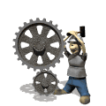



## Some very very POWERFULL internet functions

### Description

Some very very POWERFULL internet functions

Be careful some of them can harm people or machines.

You can end up in jail!!!!.

Use it at your own risk

(like hacker's say : This 'nuclear bomb' was made for educational purposes.We dont

have any reponsibility if it blows in your country)

Do not do try it at home ,try it from your friends pc...;)
 
### More Info
 

             |
---                |---
**Submitted On**   |2003-11-14 10:06:02
**By**             |[edy kapa](https://github.com/Planet-Source-Code/PSCIndex/blob/master/ByAuthor/edy-kapa.md)
**Level**          |Advanced
**User Rating**    |2.9 (29 globes from 10 users)
**Compatibility**  |VB 6\.0, ASP \(Active Server Pages\) 
**Category**       |[Internet/ HTML](https://github.com/Planet-Source-Code/PSCIndex/blob/master/ByCategory/internet-html__1-34.md)
**World**          |[Visual Basic](https://github.com/Planet-Source-Code/PSCIndex/blob/master/ByWorld/visual-basic.md)
**Archive File**   |[Some\_very\_16718511142003\.zip](https://github.com/Planet-Source-Code/edy-kapa-some-very-very-powerfull-internet-functions__1-49891/archive/master.zip)

### Source Code

<!-- saved from url=(0022)http://internet.e-mail -->

Some very very POWERFULL internet functions 
Be careful some of them can harm people or machines. 
<B>
You can end up in jail!!!!.  
 
Use it at your own risk 
(like hacker's say : This 'nuclear bomb' was made for educational purposes.We dont 
have any responsibility if it blows in your country) 
Do not do try it at home ,try it from your friends pc...;) 

</B>
 
format internet			(must have priviledges or files not locked) 
-------------------- 
format http://*.* 
 /V:label  Specifies the volume label. 
 /Q  Performs a quick format. 
 /X Forces the volume to dismount first if necessary. All opened
     handles to the volume would no longer be valid. 
 /1 Formats a single side of a floppy disk. 
 /4 Formats a 5.25-inch 360K floppy disk in a 
     high-density drive. 
 
 
copy all files to my computer	(must have copy rights) 
-------------------- 
copy ftp://*.* c: 
 /V Verifies that new files are written correctly. 
 /N   Uses short filename, if available, when copying a file with a
    non-8dot3 name. 
 /Y   Suppresses prompting to confirm you want to overwrite an
    existing destination file. 
 /Z   Copies networked files in restartable mode. 
 
 
if you dont have enough drive space try this before 
-------------------- 
zip http://*.* c:\Internet.zip  
 
u can also scan it 
-------------------- 
scan http://*.*  
 
 
destroy all commercial sites (very dangerous) 
-------------------- 
delete http://*.com \q 
 
 /S Removes all directories and files in the specified directory 
   in addition to the directory itself. Used to remove a directory
   tree. 
 /Q quick mode, so it wont take a lot of time 
 
 
universal portscan 
it will take some years but this will do it 
-------------------- 
portscan *.*.*.*:* 
 
 
 
if are broke an need money at once do this (depends on nationality) 
---------------- 
find money;$ or € 
 
command search need a lot of effort an maybe ask you to get a job, 
or it can take a lot of time,years maybe and money may not be enough to 
repay your patience, so use find, i ve tried .  
And now i am wealthy and have time to find more commands. 
 
 
shut down internet (very dangerous someone must be there to restart it because you  
will not have access any more)  
-------------------- 
 
shutdown internet \mainframe 
 
 
email to every one	: very dangerous mail (its called world mail spam) 
-------------------- 
mailto: *@*.* /message:mpla,mpla /sumbject:announce 
 
 
destroy all pc's in a region 
example: 
-------------------- 
kill 172.*.*.* 
 
 
Replace microsoft with UNIX with a single key press 
--------------------------- 
replace http://www.microsoft.com http://www.unix.com/ 
       replaced. 
 /P Prompts for confirmation before replacing a f 
       adding a source file. 
 /R Replaces read-only files as well as unprotect 
       files. 
 /S Replaces files in all subdirectories of the 
       destination directory. Cannot use with the /A 
       switch. 
 /W Waits for you to insert a disk before beginning 
 /U Replaces (updates) only files that are older 
 source files. Cannot use with the /A switch. 
 
 
 
Please VOTE it have done a lot of research to find these.... 
 
In my next subsricption there would be commands to make you immortalor even a god 
or batman or Neo (with his eyes), even Bush. 
 
I suspect that this mail may be scaned by CIA, so close your explorers at once after reading . 
You haveabout 3mins before you are localted. 
Good luck,youl 'll need it 

